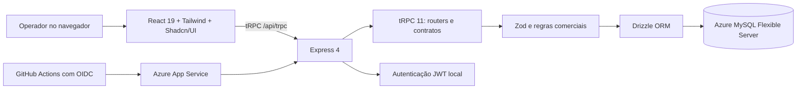

# Documentação Técnica Integral — Plataforma Vidrix

**Sistema:** Vidrix ERP — Gestão Comercial para Vidraçaria  
**Versão documentada:** versão final consolidada em 16 de agosto de 2026  
**Ambiente produtivo:** [vidrix-erp-final.azurewebsites.net](https://vidrix-erp-final.azurewebsites.net)  
**Finalidade deste documento:** apresentar, de forma rastreável, como a plataforma foi construída, quais regras de negócio implementa, como é operada e como deve ser mantida com segurança.
**Autor da consolidação:** Manus AI.

> Esta documentação descreve a versão efetivamente construída. As credenciais de utilizadores, chaves, cadeias de conexão e demais segredos não são incluídos, nem devem ser gravados no repositório.

## 1. Visão geral

O **Vidrix** é um ERP comercial orientado à operação de uma vidraçaria. A plataforma substitui o trabalho diário centralizado no banco legado Microsoft Access (`Vidracaria2026pdv.mdb`) por uma aplicação web com persistência relacional, autenticação local, histórico operacional e publicação no Azure.

O objetivo principal foi preservar os fluxos comerciais relevantes do legado e torná-los mais seguros e auditáveis: cadastro de entidades, orçamento, venda, pedido, estoque, compras, relatório e atendimento de balcão. A unidade comercial oficial para medidas é o **centímetro**, e o cálculo de área é uniforme em toda a aplicação.[1]

| Objetivo | Entrega implementada |
|---|---|
| Centralizar a operação comercial | Módulos de dashboard, clientes, produtos, fornecedores, orçamentos, balcão, pedidos, compras, estoque e relatórios. |
| Preservar o cálculo de vidros | Área em `m² = largura em cm × altura em cm ÷ 10.000`; quantidade multiplica o subtotal. |
| Evitar duplicação e perda de rastreabilidade | Transações para movimentação de estoque, conversão idempotente de orçamento e cancelamento auditável. |
| Permitir operação sem mouse | Convenção de foco, Enter, Shift+Enter, confirmações seguras e navegação por setas nos diálogos do Balcão. |
| Proteger operações sensíveis | Sessão JWT local e autorizações aplicadas no servidor por papel. |
| Modernizar a hospedagem | Aplicação publicada no Azure App Service, com MySQL Azure Flexible Server e entrega automatizada pelo GitHub Actions. |

## 2. Escopo funcional entregue

O sistema foi estruturado como um ERP de operação comercial. Os módulos abaixo fazem parte da versão atual.

| Área | Módulo | Principais funções |
|---|---|---|
| Visão geral | Dashboard | Indicadores de faturamento, pedidos por status, alertas de estoque e compras pendentes. |
| Atendimento comercial | Balcão | Inclusão de itens por código ou produto, cálculo imediato, complementos e escolha final entre orçamento ou venda. |
| Atendimento comercial | Orçamentos | Cadastro de orçamento, itens dimensionados, cálculo de metragem, PDF e conversão controlada em pedido. |
| Atendimento comercial | Pedidos de venda | Acompanhamento por status, itens, estoque, cancelamento auditável e Kanban. |
| Cadastros | Clientes | CRUD, CPF/CNPJ, telefones, WhatsApp, CEP e autopreenchimento de endereço. |
| Cadastros | Produtos | Catálogo, código único, preço, estoque, atributos de vidro e manutenção administrativa. |
| Cadastros | Fornecedores | Cadastro e consulta de fornecedores. |
| Suprimentos | Pedidos de compra | Criação, acompanhamento e recebimento transacional e idempotente. |
| Suprimentos | Estoque | Consulta de saldos, ajustes autorizados e histórico dos movimentos. |
| Gestão | Relatórios | Receita por período, análise de estoque, histórico de movimentos e exportação de dados. |

## 3. Arquitetura da solução

O Vidrix é uma aplicação web com frontend React, API tipada por tRPC, servidor Express e banco MySQL. As validações de negócio relevantes são executadas no servidor antes da persistência. A interface pode realizar pré-cálculos para orientar o operador, mas não é a fonte oficial do valor gravado em pedidos, orçamentos ou estoque.[1]

| Camada | Tecnologias | Responsabilidade |
|---|---|---|
| Interface | React 19, TypeScript, Vite, Tailwind CSS 4, Shadcn/UI, Wouter | Páginas, formulários, navegação, foco acessível, alertas e visualização de indicadores. |
| Comunicação | tRPC 11, TanStack Query, SuperJSON | Contratos tipados ponta a ponta, consultas, mutações e invalidação de dados. |
| Servidor | Node.js 22, Express 4 | Montagem da API, contexto da sessão, regras, transações e publicação dos ativos web. |
| Validação | Zod e contratos compartilhados | Normalização de dados, validação de payloads e tipos de domínio. |
| Persistência | Drizzle ORM, mysql2, Azure MySQL Flexible Server | Modelo relacional, consultas, transações e bootstrap idempotente. |
| Identidade | PBKDF2, `jose`, JWT em cookie | Login local, proteção de sessão e identificação do papel do utilizador. |
| Documentos | jsPDF, jspdf-autotable | Geração de PDF do orçamento no navegador. |
| Observabilidade e qualidade | Vitest, jsdom, logs do App Service e pipeline GitHub Actions | Regressão, contratos, testes de comportamento e diagnóstico de execução. |

### 3.1 Organização do repositório

| Diretório ou arquivo | Conteúdo e responsabilidade |
|---|---|
| `client/src/pages/` | Páginas de cada módulo operacional. Destacam-se `CounterSale.tsx`, `Products.tsx`, Clientes, Pedidos, Compras, Estoque, Relatórios e Dashboard. |
| `client/src/components/` | Componentes reutilizáveis, layout lateral, diálogos e `KeyboardNavigator.tsx`. |
| `shared/` | Schemas, contratos de formulário, regras de teclado e funções compartilhadas para código de produto. |
| `server/routers/` | Procedures tRPC organizadas por domínio: clientes, produtos, balcão, pedidos, compras, estoque, dashboard e relatórios. |
| `server/_core/` | Infraestrutura de execução do Express, contexto, tRPC e integração de ambiente. |
| `server/db.ts` | Bootstrap idempotente do esquema, operações de persistência e adaptação de dados. |
| `drizzle/schema.ts` | Fonte declarativa do modelo de dados. |
| `drizzle/` | Migrações versionadas; a migração `0010_soft_cerise.sql` introduz o código único de produto. |
| `server/*.test.ts` | Testes unitários, de contrato, integração e comportamento de teclado. |
| `.github/workflows/` | Pipeline de publicação autenticado por OIDC para o Azure. |

## 4. Autenticação, sessão e autorização

### 4.1 Autenticação local

As dependências de autenticação Manus foram removidas do fluxo de negócio. O Vidrix utiliza autenticação própria, com utilizador e senha cadastrados localmente. A senha é derivada por PBKDF2; o servidor assina uma sessão JWT com validade controlada e a armazena em cookie. O contexto tRPC identifica o utilizador autenticado a cada requisição protegida.

Os componentes centrais desse mecanismo são `server/local-auth.ts`, `server/_core/context.ts` e `server/_core/trpc.ts`. O frontend consulta a sessão atual e encaminha para a tela local de login quando necessário.

### 4.2 Papéis e política aplicada no servidor

O controlo não depende apenas de esconder botões. A procedure `adminProcedure` verifica, no servidor, se `ctx.user.role` é `admin` ou `superadmin`; um utilizador comum recebe `FORBIDDEN` antes da mutação de alto impacto. Consultas operacionais permanecem protegidas por autenticação, mas acessíveis aos papéis autorizados.[2]

| Operação | `user` | `admin` | `superadmin` |
|---|---:|---:|---:|
| Consultar cadastros, indicadores, estoque e relatórios | Sim | Sim | Sim |
| Cadastrar e editar clientes | Sim | Sim | Sim |
| Criar orçamento e concluir atendimento de balcão | Sim | Sim | Sim |
| Criar, editar ou excluir produtos | Não | Sim | Sim |
| Criar, editar ou excluir fornecedores | Não | Sim | Sim |
| Criar, receber ou cancelar pedidos de compra | Não | Sim | Sim |
| Ajustar estoque manualmente | Não | Sim | Sim |
| Alterar status ou cancelar pedidos com efeito no estoque | Não | Sim | Sim |
| Criar uma conta de superadmin | Não | Não | Sim |

> Mesmo um administrador não ignora as regras comerciais: estoque, recebimento, conversão e cancelamento continuam obrigatoriamente transacionais e auditáveis.

## 5. Modelo de dados e integridade

O esquema Drizzle e o bootstrap de `server/db.ts` são a referência de estrutura. O bootstrap usa comandos idempotentes (`CREATE TABLE IF NOT EXISTS` e alterações controladas), permitindo iniciar ambientes sem reexecutar manualmente todas as intervenções estruturais.

| Grupo de dados | Entidades principais | Finalidade |
|---|---|---|
| Identidade | `users` | Utilizadores locais, hash de senha e papel. |
| Cadastros | `clients`, `products`, `suppliers` | Base comercial do ERP. Clientes incluem CPF/CNPJ, contatos, WhatsApp e endereço; produtos incluem `code` único. |
| Comercial | `quotes`, `quoteItems`, `orders`, `orderItems` | Orçamento, itens, pedido, status, totais e referências de conversão. |
| Balcão | `counterSaleItems`, `saleComplements` | Itens e complementos do atendimento unificado. |
| Suprimentos | `purchaseOrders`, `purchaseOrderItems` | Compra, seus itens e controle de recebimento. |
| Estoque | `stockMovements` | Histórico auditável de entrada, saída, ajuste, venda, conversão e estorno. |
| Migração | `legacyImportRecords` e estruturas de importação | Preservação de material histórico, rastreabilidade de lotes e prevenção de duplicidade. |

### 5.1 Princípios de persistência

| Princípio | Implementação |
|---|---|
| Unidade de medida inequívoca | Largura e altura comerciais são recebidas em centímetros. |
| Total calculado a partir de itens | Orçamentos e pedidos recalculam os totais com base nos subtotais persistidos. |
| Estoque atômico | Saldo e movimento são modificados na mesma transação, com bloqueio do produto quando necessário. |
| Recebimento sem repetição | Pedido de compra recebido uma vez não cria nova entrada se for reenviado. |
| Cancelamento sem exclusão física | O pedido é mantido, recebe motivo/data/utilizador e realiza estorno apenas uma vez. |
| Código único de produto | `products.code` é único e pode ser consultado no Balcão. |

## 6. Regras de negócio comerciais

### 6.1 Cálculo de metragem e preço

As dimensões são inseridas em centímetros. A fórmula que deve ser mantida em todos os fluxos é:

> **Área em m² = (largura em cm × altura em cm) ÷ 10.000**  
> **Subtotal = área em m² × quantidade × preço por m²**

Exemplo: uma peça de `100 cm × 80 cm`, quantidade `2` e preço de `R$ 100,00/m²` resulta em área unitária de `0,80 m²` e subtotal de `R$ 160,00`. A normalização aceita vírgula decimal brasileira e converte os valores antes de executar as validações de positividade e finitude.

### 6.2 Orçamentos

O módulo de orçamentos cria um documento comercial não baixado no estoque. Os itens podem ser incluídos, alterados ou removidos, e o total do cabeçalho é recalculado. O PDF é montado no frontend a partir dos mesmos dados retornados ao operador.

| Ação | Efeito |
|---|---|
| Criar orçamento | Persiste cabeçalho em `quotes`. |
| Inserir ou alterar item | Valida dimensões, quantidade e preço; recalcula subtotal e total. |
| Gerar PDF | Disponibiliza proposta comercial baseada nos itens atuais. |
| Converter em pedido | Cria pedido e itens em transação; evita nova conversão se já houver pedido associado. |

### 6.3 Pedidos, estoque e cancelamento

O pedido representa uma obrigação operacional, portanto não deve ser excluído para corrigir uma situação comercial. Alterações que modificam item ou status verificam regras de transição e geram movimentos rastreáveis.

| Evento | Movimento de estoque associado |
|---|---|
| Conversão de orçamento ou venda com baixa | `order` ou `counter_sale`. |
| Aumento de quantidade em pedido | `order_adjust`. |
| Redução ou remoção de item | `order_item_remove`. |
| Cancelamento aprovado | `order_cancel`, uma única vez. |
| Recebimento de compra | `purchase_receive`. |
| Ajuste autorizado | Movimento de ajuste de estoque. |

### 6.4 Venda direta de Balcão

O Balcão é a tela unificada de atendimento. O operador monta os itens primeiro e escolhe o resultado apenas no encerramento: **salvar como orçamento** ou **concluir como venda**. Não é obrigatório selecionar cliente no início; o vínculo se torna obrigatório ao concluir, podendo-se buscar um cliente existente ou executar o cadastro rápido.

Além dos vidros, o fluxo permite complementos de **acessório, massa, tarugo, moldura e montagem**. Um complemento pode ser ligado a um produto somente quando deve movimentar o estoque. Os dados são persistidos no atendimento e compõem o total comercial.

### 6.5 Códigos de produto

O código é apresentado antes do seletor de produto no Balcão. O campo é um `combobox` com os códigos disponíveis; ao digitar ou selecionar um código válido e pressionar **Enter**, o produto correspondente é selecionado e o foco avança para o próximo campo.

| Origem do produto | Padrão aplicado |
|---|---|
| Kit Frontal migrado do MDB | `KF-{n}`. |
| Kit Canto migrado do MDB | `KC-{n}`. |
| Produto que não possuía código | Preenchimento retroativo com identificador interno estável. |
| Produto novo sem código informado | Geração automática no padrão `VID-{id}`. |

## 7. Usabilidade por teclado

O componente global `KeyboardNavigator.tsx`, montado em `App.tsx`, fornece uma convenção reutilizável para as telas operacionais. A implementação respeita elementos que controlam seu próprio teclado e restringe o foco ao diálogo ativo, evitando que o operador avance para o conteúdo por trás de um modal.

| Interação | Regra implementada |
|---|---|
| Enter em campo comum | Confirma o valor e avança para o próximo controle elegível. |
| Shift+Enter em textarea | Preserva a quebra de linha. |
| Select nativo | O operador confirma a escolha; o foco só avança depois da confirmação. |
| Diálogo ativo | A navegação fica limitada aos elementos do diálogo. |
| Foco | Anel visível de foco para indicar o campo ativo. |
| Campo Preço no Balcão | Enter abre o diálogo “Adicionar novo produto” ou “Finalizar atendimento”. |
| Escolha no diálogo de preço | Setas esquerda/direita alternam entre as opções e Enter confirma. |
| Escolha de resultado | Setas esquerda/direita alternam entre “Salvar como orçamento” e “Concluir como venda”; Enter abre a etapa de cliente correspondente. |

O Balcão inicia com foco no campo **Código** assim que o catálogo está disponível. Seus botões de resultado implementam `onKeyDown` próprio para que o navegador global não intercepte a confirmação quando eles estão em foco.

## 8. Descrição dos módulos operacionais

### 8.1 Dashboard e relatórios

O Dashboard reúne indicadores tipados: receita, pedidos por status, alertas de estoque e pendências de compra. O router de relatórios recebe filtros de período com `startDate` e `endDate`, normaliza o intervalo e retorna contratos específicos para receita, análise de estoque e histórico de movimentos. As origens do movimento são apresentadas com rótulos compreensíveis ao operador.

### 8.2 Clientes

O cadastro de cliente permite pessoa física ou jurídica, documento, telefone, WhatsApp, e-mail e endereço. O formulário aplica máscaras, valida dígitos de CPF/CNPJ e consulta CEP para preencher endereço, bairro, cidade e UF. Estados de consulta, sucesso e falha são apresentados na interface.

### 8.3 Produtos e fornecedores

Produtos formam o catálogo de venda e estoque. A manutenção de produto exige papel administrativo e contempla código, nome, preço, estoque e atributos comerciais. Fornecedores também são administrados pelo mesmo nível de autorização. As consultas permanecem disponíveis para os utilizadores autenticados necessários à operação.

### 8.4 Compras e recebimento

Pedidos de compra organizam fornecedores e itens de suprimento. O recebimento utiliza transação e idempotência: o estoque entra uma única vez, mesmo se ocorrer repetição de requisição ou clique. A operação gera a referência de histórico correspondente.

### 8.5 Estoque

O módulo mostra saldo atual e histórico de eventos. Ajuste manual é exclusivo de administrador ou superadministrador. A aplicação não trata uma alteração de saldo como edição silenciosa: o movimento associado precisa permanecer visível para auditoria.

## 9. Migração e auditoria do MDB legado

O arquivo `Vidracaria2026pdv.mdb` foi inventariado e analisado para mapear estruturas, códigos de produtos, regras e eventos relevantes. A migração foi desenhada para ser idempotente e conservar a rastreabilidade: entidades compatíveis foram materializadas no MySQL, enquanto material histórico sem conversão direta foi preservado como registro de importação em vez de ser transformado em pedidos artificiais.[3]

| Etapa | Resultado |
|---|---|
| Inventário do MDB | Tabelas, campos, relações, formulários, consultas, macros e módulos VBA foram classificados. |
| Mapeamento | Regras comerciais e eventos foram associados às telas, routers e tabelas do Vidrix. |
| Migração | Clientes, produtos/kits e dados aprovados foram importados por processo autenticado e idempotente. |
| Preservação dos códigos | Kits Frontal e Canto receberam os padrões `KF` e `KC` identificados no legado. |
| Paridade | Foi elaborada matriz de paridade, com evidências, limitações e roteiro de evolução. |

Os relatórios de suporte são [`MIGRATION_MDB_ANALYSIS.md`](./MIGRATION_MDB_ANALYSIS.md), [`MDB_RULE_EVENT_MATRIX.md`](./MDB_RULE_EVENT_MATRIX.md), [`MDB_PARITY_FINAL_REPORT.md`](./MDB_PARITY_FINAL_REPORT.md) e [`AUDITORIA_FINAL_MDB_VIDRIX_2026-08-14.md`](./AUDITORIA_FINAL_MDB_VIDRIX_2026-08-14.md).

## 10. Testes e evidências de qualidade

A base de regressão consolida **97 testes aprovados**, cobrindo regras comerciais, contratos, integrações, permissões, dashboard, relatórios, códigos de produto e comportamento de teclado. A compilação de produção é executada com `pnpm build` antes da publicação.[4]

| Grupo de testes | Cobertura principal |
|---|---|
| Regras comerciais | Dimensões em cm, normalização decimal, validação e cálculo de subtotal. |
| Estoque e pedidos | Baixa, ajuste, remoção, cancelamento com estorno único e histórico. |
| Compras | Recebimento transacional e idempotente. |
| Balcão | Orçamento/venda, cliente no encerramento, complementos, código de produto e teclado. |
| Catálogo | Geração, unicidade e preenchimento retroativo dos códigos. |
| Segurança | Login local, superadmin e segregação `user`/`admin`/`superadmin`. |
| Gestão | Contratos dos indicadores de dashboard e dos filtros/saídas de relatórios. |
| Interface | Navegação por Enter, Shift+Enter, selects nativos, foco em diálogos e setas nos fluxos de decisão. |

Os documentos [`AUDITORIA_VISUAL_AZURE_2026-08-14.md`](./AUDITORIA_VISUAL_AZURE_2026-08-14.md) e [`VALIDACAO_CODIGO_PRODUTO_AZURE_2026-08-14.md`](./VALIDACAO_CODIGO_PRODUTO_AZURE_2026-08-14.md) registram evidências de validação no ambiente publicado.

## 11. Publicação no Azure

| Item | Configuração consolidada |
|---|---|
| Serviço de aplicação | Azure App Service Linux, aplicação `vidrix-erp-final`. |
| URL pública | `https://vidrix-erp-final.azurewebsites.net`. |
| Grupo de recursos | `vidrix-prod-rg`. |
| Banco de dados | Azure MySQL Flexible Server, servidor `vidrix-mysql-server`, banco `flexibleserverdb`, com TLS. |
| Runtime | Node.js 22. |
| Branch de publicação | `release/azure-auth-fix`. |
| Autenticação do pipeline | OpenID Connect (OIDC) no GitHub Actions, sem perfil de publicação armazenado no código. |
| Entrada de produção | `server/azure-startup.ts`, compilado em `dist/azure-startup.js`. |

### 11.1 Fluxo de entrega

1. Alterar código e atualizar/produzir teste de regressão correspondente.
2. Executar `pnpm test`, `pnpm check` e `pnpm build` localmente.
3. Rever a mudança, a migração e os impactos em dados/estoque.
4. Salvar checkpoint recuperável antes do envio.
5. Enviar a alteração revisada à branch de publicação.
6. Acompanhar o workflow GitHub Actions até o estado de sucesso.
7. Abrir a URL pública, autenticar-se e validar o fluxo afetado.

O App Service deve receber segredos e configuração por variáveis de ambiente do Azure. Não se deve incluir `.env`, senha, certificado, token, string de conexão ou exportação de produção no repositório ou no pacote de entrega.

## 12. Manual operacional resumido

### 12.1 Atendimento de Balcão

1. Abra **Balcão** no grupo “Atendimento Comercial”.
2. O foco inicia em **Código**. Digite ou escolha um código e pressione **Enter** para selecionar o produto.
3. Informe largura, altura, quantidade e preço por metro quadrado. As medidas são em centímetros.
4. No preço, pressione **Enter**. Use as setas para escolher novo produto ou finalizar atendimento.
5. Ao finalizar, escolha **Salvar como orçamento** ou **Concluir como venda** com as setas e confirme com **Enter**.
6. Pesquise o cliente ou cadastre-o rapidamente. O cliente é obrigatório na conclusão.
7. Revise o total e confirme o resultado. Venda movimenta estoque; orçamento não movimenta estoque.

### 12.2 Orçamento para pedido

1. Localize o orçamento e confira cliente, itens, dimensões e valores.
2. Gere o PDF apenas depois da conferência comercial.
3. Faça a conversão para pedido quando a venda estiver aprovada.
4. O sistema impede conversão duplicada; não crie um novo pedido manualmente para o mesmo orçamento.

### 12.3 Compras e estoque

1. Cadastre fornecedor e itens de compra como administrador.
2. Confirme fisicamente a mercadoria antes de acionar o recebimento.
3. Receba o pedido uma única vez; a operação é protegida contra repetição.
4. Consulte o histórico de estoque ao investigar diferenças. Ajustes devem ser justificados e executados somente por perfil administrativo.

### 12.4 Cancelamento de pedido

1. Não exclua o pedido para corrigir uma venda.
2. Use a ação de cancelamento autorizada e informe o motivo.
3. Confirme no histórico o estorno associado. Repetir o cancelamento não pode produzir um segundo estorno.

## 13. Manutenção, evolução e recuperação segura

| Situação | Procedimento recomendado |
|---|---|
| Alteração de regra comercial | Atualizar primeiro o teste de regra e depois a implementação. Validar cálculo e reflexo em estoque. |
| Mudança de schema | Atualizar `drizzle/schema.ts`, gerar e revisar migração, aplicar de forma controlada e manter o bootstrap idempotente compatível. |
| Falha de estoque | Preservar pedido e histórico; não editar saldo diretamente sem movimento rastreável. |
| Problema em produção | Consultar logs do App Service e pipeline; recuperar a aplicação pelo último checkpoint estável antes de realizar alterações invasivas. |
| Recuperação de dados | Usar os mecanismos de backup/restauração configurados no Azure e manter o MDB original e os relatórios de migração como referência histórica. |
| Nova modalidade comercial | Modelar contrato, dados, testes, regra transacional e interface antes de disponibilizar em produção. |

### 13.1 Itens de evolução recomendados

As futuras evoluções devem seguir o ciclo **requisito → contrato → teste → migração → implementação → homologação → publicação**. Prioridades típicas incluem aprofundamento de regras específicas de composição/box, novos relatórios gerenciais, maior cobertura de interface ponta a ponta e políticas formais de cópia/recuperação verificadas periodicamente.

## 14. Pendências de validação manual final

As regras e contratos de teclado estão cobertos automaticamente. Para encerrar a homologação visual, permanecem úteis os roteiros de interface abaixo, que não alteram a entrega funcional já publicada:

| Roteiro | Condição de aceite |
|---|---|
| Setas entre orçamento e venda no Balcão | O foco percorre os dois botões com ←/→ e Enter abre a etapa correta de cliente. |
| Formulários de Clientes, Produtos, Fornecedores e Compras | Enter, Shift+Enter, selects, salvar e cancelar preservam sequência previsível. |
| Estoque, Relatórios, Orçamentos e Pedidos | Filtros, diálogos, tabelas e Kanban permanecem utilizáveis por teclado. |
| Máscaras e CEP | Máscaras de CPF/CNPJ, telefone, WhatsApp e CEP; consulta de CEP, erro e sucesso visíveis. |
| Responsividade | Modais e formulários validados em desktop e largura móvel. |

> Durante a última sessão de validação, o Balcão publicado foi carregado com o diálogo de decisão aberto e os contratos automatizados de setas foram confirmados. A continuidade da inspeção visual no navegador do utilizador depende de a conexão dessa sessão do navegador responder novamente.

## 15. Referências

| Documento | Conteúdo relacionado |
|---|---|
| [`IMPLEMENTATION_MANUAL.md`](./IMPLEMENTATION_MANUAL.md) | Manual anterior de implementação, operação e implantação. |
| [`UNIFIED_COUNTER_FLOW_SPEC.md`](./UNIFIED_COUNTER_FLOW_SPEC.md) | Especificação do fluxo unificado de Balcão. |
| [`POLITICA_PERMISSOES_OPERACIONAIS.md`](./POLITICA_PERMISSOES_OPERACIONAIS.md) | Matriz de autorização operacional. |
| [`MDB_PARITY_FINAL_REPORT.md`](./MDB_PARITY_FINAL_REPORT.md) | Conclusões de paridade entre MDB e Vidrix. |
| [`AUDITORIA_FINAL_MDB_VIDRIX_2026-08-14.md`](./AUDITORIA_FINAL_MDB_VIDRIX_2026-08-14.md) | Auditoria final, evidências e limitações. |
| [`DEPLOYMENT.md`](./DEPLOYMENT.md) | Notas de implantação e operação Azure. |
| [`AZURE_GITHUB_ACTIONS_STATUS.md`](./AZURE_GITHUB_ACTIONS_STATUS.md) | Estado e configuração do pipeline de publicação. |

---

**Conclusão:** a plataforma Vidrix foi construída como um ERP web comercial com regras centralizadas, autenticação local, autorização no servidor, integração transacional de estoque, atendimento de balcão unificado, rastreabilidade de migração e publicação automatizada no Azure. O processo de evolução deve preservar essa arquitetura e sempre acrescentar evidência de teste e validação antes de uma mudança produtiva.

[1]: ./IMPLEMENTATION_MANUAL.md "Manual de implementação, operação e implantação"
[2]: ./POLITICA_PERMISSOES_OPERACIONAIS.md "Política de permissões operacionais"
[3]: ./MDB_PARITY_FINAL_REPORT.md "Relatório final de paridade MDB × Vidrix"
[4]: ./AUDITORIA_FINAL_MDB_VIDRIX_2026-08-14.md "Auditoria final MDB × Vidrix"
